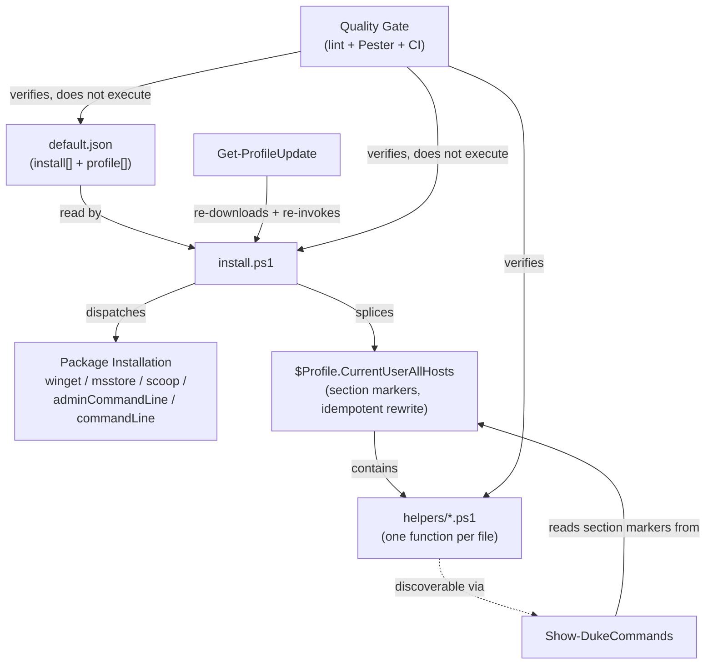

# High-Level Design: powershellScripts

## Problem

Setting up a new Windows machine (or bringing an existing one back in sync) means re-installing the same set of packages and re-recreating the same set of PowerShell profile conveniences by hand, every time. Doing this manually is slow, easy to get inconsistent across machines, and doesn't scale to "run one command, walk away."

## Approach

A single declarative manifest (`default.json`) drives a single orchestrator (`install.ps1`) that does two independent things: installs packages across five sources (winget, msstore, scoop, plus raw `adminCommandLine`/`commandLine` snippets for anything that isn't a package), and splices a library of independent, single-purpose PowerShell functions into the user's profile. The splice mechanism is idempotent — re-running the installer strips and rewrites each managed profile section rather than duplicating it — so the same command that bootstraps a fresh machine also refreshes an existing one. A self-update entry point (`Get-ProfileUpdate`) lets an already-bootstrapped machine pull the latest manifest and re-apply it without the user re-running the original install command by hand. A repo-quality gate (lint + Pester tests, run manually and in CI) verifies the manifest's shape and the helper library's conventions independently of runtime behavior.

## Target Users

A single developer (or a small number of developers using this repo as a personal template) setting up or maintaining their own Windows development machines. Evidence for this scope: no multi-tenant configuration in `default.json` beyond CLI parameters, no user-management concepts anywhere in the code, and several helpers are personal/opinionated conveniences (a Beyond Compare trial reset, a `Show-DukeCommands` discovery tool named after the profile's own branding) rather than general-purpose tooling aimed at an unknown audience. The repo is public and AGPL-licensed, so it's shareable/forkable as a template, but nothing in the code anticipates configuring it for someone else's package/helper set beyond editing `default.json` directly.

## Goals

- Provision a fresh Windows machine's packages and PowerShell profile helpers with one command.
- Keep re-running that command safe and idempotent — no duplicated profile sections, no re-prompting for already-installed packages.
- Keep `default.json` as the single source of truth for both "what gets installed" and "what gets spliced into the profile."
- Catch manifest/helper drift (a broken link, a malformed helper file, a syntax error in `install.ps1`) via automated lint and tests before it reaches a user's machine.

## Non-Goals

- **Not cross-platform.** The install mechanism is Windows-specific by construction: winget/msstore/scoop as package sources, `HKCU` registry access, `$Profile.CurrentUserAllHosts` as the splice target.
- **Not a full app-configuration manager.** Beyond the `commandLine`/`adminCommandLine` escape hatch (currently used only for MiKTeX/LyX post-install config), the system does not manage arbitrary application configuration.
- **`install.ps1` is never executed in CI.** The quality gate verifies shape and parse-validity only; real package installs and profile writes are explicitly out of scope for automated verification (documented in AGENTS.md, confirmed by `.github/workflows/ci.yml`'s job list).
- **No enforced two-way helper↔manifest binding today.** Nothing currently guarantees every file in `helpers/` has a corresponding `default.json` registration — only the reverse direction is checked (see `quality-gate`'s `QUALITY-010` gap).

## Tenets

- **Blast radius decides how defensive to be.** Local, reversible dev-service toggles (a registry tweak, a daemon restart, a backend toggle) can stay thin with minimal error handling; anything that installs software, rewrites the profile, or runs elevated commands must fail loud rather than continuing silently past a failure.
- **No shared abstraction across independent helpers until duplication proves costly.** Each helper hand-rolls its own retry/polling/health-check logic rather than reaching for a shared utility on the first instance of a similar pattern; only extract shared code once duplication has caused a real maintenance problem.
- **New capability is a new file, not a new parameter.** When a helper needs to do something meaningfully different from what it does today, prefer adding a new `helpers/<Verb-Noun>.ps1` file over growing an existing helper's parameter surface — consistent with the one-function-per-file convention.

## System Design

**Segments** (see `docs/intent/` for full LLDs, `docs/arrows/` for status):
1. **Bootstrap & Self-Update** — the orchestrator: manifest parsing, package dispatch, profile splicing, and the self-update re-entry point.
2. **Command Discovery** — `Show-DukeCommands`, the only helper with a structural dependency on the Bootstrap segment's section-marker convention.
3. **Software Update** — `Update-Software`, a full-stack update wrapper across winget, scoop (apps and buckets), and uv-managed tools.
4. **Session Logging** — `Invoke-TeeCommand`, a general-purpose console+file tee utility.
5. **BeyondCompare Trial Reset** — `Reset-BeyondCompare`, a standalone registry tweak.
6. **Dev Workflow Toggles** — `Start-ADBDaemon`, `Switch-Kubernetes`, `Start-ClaudeHeadroom`: three independent background-dev-service toggles grouped by shared shape, not shared code.
7. **Repo Quality Gate** — lint config, Pester specs, and CI wiring that verify the repo's own source correctness.

## Key Design Decisions

- **Single JSON manifest as source of truth.** `default.json`'s `install[]`/`profile[]` split drives both package installation and profile splicing from one file, so there's exactly one place to add a new package or a new helper registration (per-segment rationale: `bootstrap` LLD).
- **`Invoke-Expression`-based escape hatch for non-package post-install steps.** `adminCommandLine`/`commandLine` entries run arbitrary PowerShell — an intentional, lint-acknowledged trade-off (see `PSScriptAnalyzerSettings.psd1`'s inline rationale) rather than building a more constrained post-install DSL.
- **Idempotency via strip-then-rewrite, not diff-and-patch.** Every profile section is fully replaced on each run based on its marker, trading "manual edits inside a managed section survive a re-run" for a guarantee that the profile always matches the current manifest.
- **Self-update via dynamic script download, not version-pinned releases.** `Get-ProfileUpdate` always re-downloads and re-invokes `install.ps1` from `main`, favoring always-latest convenience over reproducibility or offline resilience.
- **One function per helper file, filename-matched, comment-help mandated.** This convention (documented in AGENTS.md) is what makes `Show-DukeCommands`' discovery mechanism possible, and is verified (parse + name-match) by `Helpers.Tests.ps1` — though the `.SYNOPSIS` half of the convention is not yet automatically checked (`QUALITY-011`).
- **`install.ps1` is never run in CI.** Verification is limited to shape/parse checks; real installs and profile writes are judged unsafe to automate (AGENTS.md, confirmed in `.github/workflows/ci.yml`).

## Success Metrics

- A fresh Windows machine reaches a fully-configured state (all required packages installed, all profile helpers available) after a single `pwsh -File install.ps1` run.
- Re-running the installer on an already-configured machine changes nothing observable beyond refreshing profile section content — no duplicated sections, no duplicate install prompts for already-installed packages.
- CI (lint + Pester) passes on every push/PR to `main` before a change is considered mergeable.
- A newly added helper is visible via `Show-DukeCommands` immediately after the next profile refresh, with no manual wiring beyond the documented two-file change (`helpers/<Verb-Noun>.ps1` + a `default.json` registration).

**Falsification signals:** a fresh-machine run that requires manual follow-up steps not captured in `default.json`; a re-run that duplicates or corrupts profile sections; a merged PR that later turns out to have broken `install.ps1`'s parse-validity or a helper's function-name contract undetected by CI.

## References

- `AGENTS.md` — repo-level agent guidance and architecture description (source of much of this HLD's Approach/Non-Goals framing).
- `README.md`, `LICENSE` — project scaffolding, not modeled as arrow segments.
- Per-segment LLDs: `docs/intent/bootstrap/`, `docs/intent/show-duke-commands/`, `docs/intent/update-software/`, `docs/intent/invoke-tee-command/`, `docs/intent/reset-beyond-compare/`, `docs/intent/dev-workflow-toggles/`, `docs/intent/quality-gate/`.
- Arrow overlay: `docs/arrows/index.yaml`.
